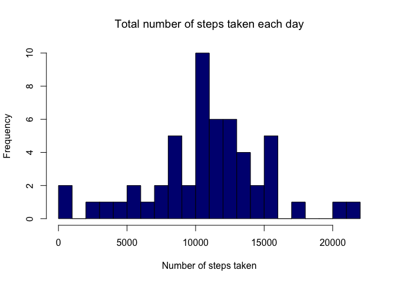
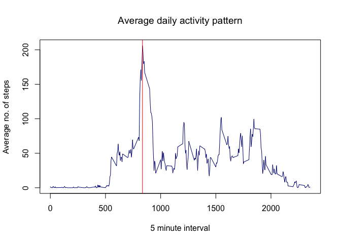
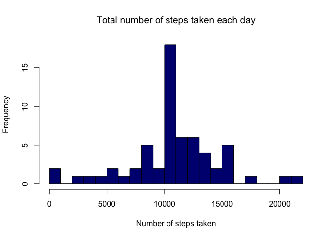
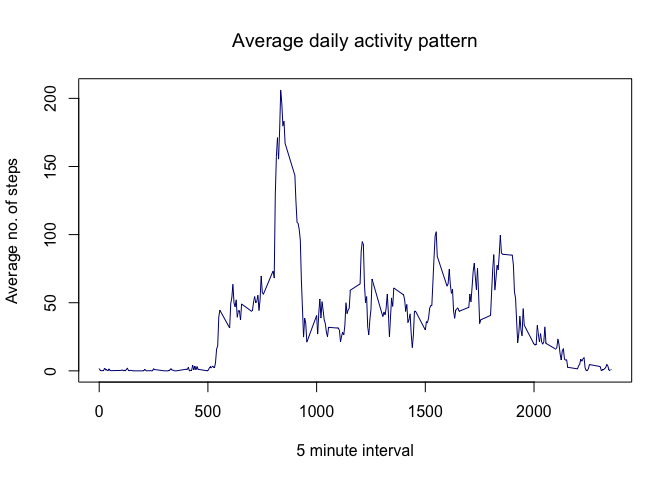

# Reproducible Research: Peer Assessment 1


## Loading and preprocessing the data
Source file is CSV format in a zipped archive. First will unzip and then read the csv file into a dataframe.

```r
setwd("~/datascience/represearch/repdataProject")
dataFile <- "activity.zip"
dataFile <- unzip(dataFile)
```


```r
df <- read.csv(dataFile)
# create a POSIX date column
df$date <- as.POSIXct(df$date, format = "%Y-%m-%d")
```

## What is mean total number of steps taken per day?


```r
# Aggregate stats by day
byDay <- aggregate(df$steps, by=list(df$date), FUN=sum)
names(byDay) <- c("date", "steps")

# plot Histogram
hist(byDay$steps, breaks = 25, 
     main = "Total number of steps taken each day",
     xlab = "Number of steps taken",
     ylab = "Frequency",
     col  = "navy")
```

<!-- -->

```r
# Calculate mean and median (ignore the "NA" values)
mean(byDay$steps, na.rm = TRUE)
```

```
## [1] 10766.19
```

```r
median(byDay$steps, na.rm = TRUE)
```

```
## [1] 10765
```


## What is the average daily activity pattern?


```r
stepsInterval <- aggregate(df, by=list(df$interval), FUN=mean, na.rm=TRUE)

# Setup some plot formatting and labels
main <- "Average daily activity pattern"
xlab <- "5 minute interval"
ylab <- "Average no. of steps"

plot(stepsInterval$interval, stepsInterval$steps, type="l", main=main, xlab=xlab, ylab=ylab, col="navy")

# Get the maximum steps interval & draw vertical line to visually confirm accuracy
maxSteps <- stepsInterval[which.max(stepsInterval$steps),]
abline(v=maxSteps$interval, col="red", xlab=maxSteps$interval)
```

<!-- -->

```r
# display the interval showing maximum steps averaged over each day
maxSteps$interval
```

```
## [1] 835
```


## Imputing missing values


```r
# Calculate and report the total number of missing values in the dataset (i.e. the total number of rows with 
nrow(df) - nrow(na.omit(df))
```

```
## [1] 2304
```

```r
# Scheme to fill-in NA with data
# Will fill in any NA with the average of steps column
df$steps[is.na(df$steps)] <- mean(df$steps, na.rm = TRUE)

# show there are no NA values now
nrow(df) - nrow(na.omit(df))
```

```
## [1] 0
```

```r
# New histogram plot
newByDay <- aggregate(df$steps, by=list(df$date), FUN=sum)
names(newByDay) <- c("date", "steps")
hist(newByDay$steps, breaks = 25,
     main = "Total number of steps taken each day",
     xlab = "Number of steps taken",
     ylab = "Frequency",
     col  = "navy")
```

<!-- -->

```r
# Calculate mean and median (ignore the "NA" values)
mean(newByDay$steps, na.rm = TRUE)
```

```
## [1] 10766.19
```

```r
median(newByDay$steps, na.rm = TRUE)
```

```
## [1] 10766.19
```

The `NA` values from the original dataset were replaced with the column average. The histogram
shows how the median/mean values are now much more numerous and thus skew the histogram.

## Are there differences in activity patterns between weekdays and weekends?


```r
# Add new column
df$dayType <- ifelse(weekdays(df$date) %in% c("Saturday", "Sunday"), "weekend","weekday")
stepsInterval$dayType <- ifelse(weekdays(stepsInterval$date) %in% c("Saturday", "Sunday"), "weekend","weekday")

# Modify column to be type "factor"
df$dayType <- as.factor(df$dayType)
stepsInterval$dayType <- as.factor(stepsInterval$dayType)

# Setup some plot formatting and labels
main <- "Average daily activity pattern"
xlab <- "5 minute interval"
ylab <- "Average no. of steps"

plot(stepsInterval$interval, stepsInterval$steps, type="l", main=main, xlab=xlab, ylab=ylab, col="navy")
```

<!-- -->

